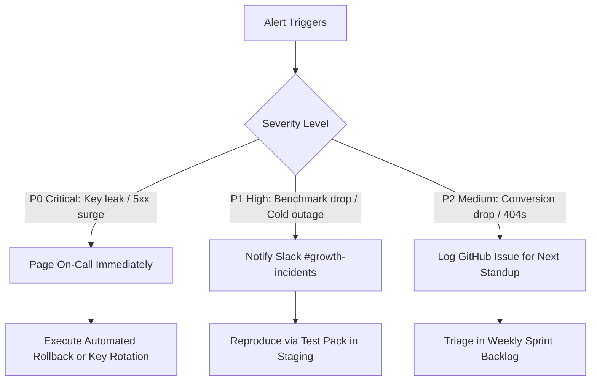

# Operational & Growth Alerting Specification

**Author:** SRE Director & Analytics Lead  
**Scope:** Automated alert rules, escalation matrices, incident response protocols, and notification channels.

---

## 1. Alert Rule Definitions & Thresholds

| Alert ID | Alert Name | Severity | Condition / Threshold | Evaluation Window | Notification Target | Action Protocol |
| :---: | :--- | :---: | :--- | :---: | :--- | :--- |
| **ALT-01** | High Error Rate Surge | **P0 (Critical)** | Error rate $> 5\%$ of all queries | 5 minutes | On-Call Pager / Slack | Check Render memory; verify Cloudflare isolate limits; inspect recent commits. |
| **ALT-02** | Secret Leakage Invariant | **P0 (Critical)** | Regex match for `POE_ACCESS_KEY` or `Bearer` in log stream | Instantaneous | Security Lead / SMS | Immediate service shutdown; rotate compromised keys; scrub log repository. |
| **ALT-03** | SSE Done Event Failure | **P0 (Critical)** | Streams terminating without `done` event $> 1\%$ | 10 minutes | Engineering Lead | Inspect upstream Poe connection; verify SSE keep-alive heartbeats. |
| **ALT-04** | Benchmark Accuracy Drift | **P1 (High)** | Benchmark suite accuracy on clean cafe receipt $< 98\%$ | Daily Run | QA Architect | Rollback recent parser changes; run local Vitest regression suite. |
| **ALT-05** | Render Cold Start Outage | **P1 (High)** | Render `/health` ping fails 2 consecutive checks | 15 minutes | DevOps Lead | Check Render free tier monthly instance hours; verify Cloudflare keep-warm cron. |
| **ALT-06** | Abrupt Conversion Drop | **P2 (Medium)** | First-message conversion drops by $> 25\%$ WoW | 24 hours | Growth Team | Inspect Poe introduction message rendering; test UI layout in mobile client. |
| **ALT-07** | Broken Sitemap / 404 Spike | **P2 (Medium)** | Marketing site returns 4xx/5xx on core URLs | 1 hour | SEO Director | Check Cloudflare Pages deployment; verify domain DNS records. |

---

## 2. Escalation & Incident Triage Matrix

