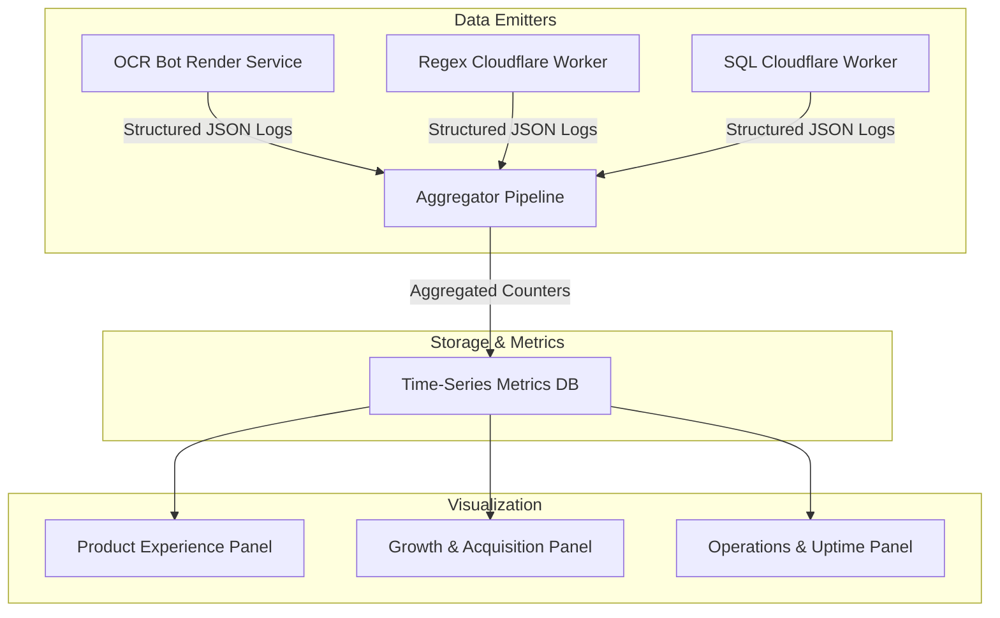

# Privacy-Safe Growth & Performance Dashboard Specification

**Author:** Analytics Lead & SRE Director  
**Scope:** Dashboard architecture, visualization components, metric aggregations, and data refresh cycles across Product, Growth, and Operational metrics.

---

## 1. Dashboard Architecture (Zero-PII Aggregations)

To respect privacy and comply with enterprise data governance, the dashboard queries **only pre-aggregated counters and histograms**, never individual request logs or payload bodies.

---

## 2. Dashboard Panel Specifications

### Panel 1: Product Quality & Experience
- **Total Queries by Bot:** Multi-line graph displaying hourly query arrivals for `ocr-doc-bot`, `regex-bot`, and `sql-bot`.
- **Task Success Rate:** Gauge showing percentage of queries with `outcome == 'success'` (Target: $> 90\%$).
- **Failure Category Breakdown:** Stacked bar chart showing rejections by category (`image_blurred`, `no_schema`, `redos_halt`, `syntax_error`).
- **Low-Confidence OCR Frequency:** Percentage of OCR extractions with overall confidence $< 80\%$.
- **User Feedback Ratio:** Thumbs-up vs thumbs-down ratio per bot route.

### Panel 2: Growth & Funnel Velocity
- **Weekly Successful Tasks Completed (WSTC):** Primary North-Star KPI single-value stat with WoW percentage trend.
- **First-Message Conversion Rate:** Ratio of `first_query_received` to `bot_settings_loaded`.
- **Suggested Reply Engagement Rate:** Percentage of responses where a user clicked an emitted suggested reply.
- **Cross-Bot Handoff CTR:** Percentage of users who navigated from one bot to a sibling bot in the same session.
- **Organic Landing Page Traffic:** Daily organic clicks and impressions from search console exports.

### Panel 3: Operational Reliability & Infrastructure
- **P50 / P95 / P99 Latency:** Latency percentiles bucketed by service (Cloudflare Workers vs Render).
- **Cold-Start Monitor:** Render keep-warm ping status (pings sent every 10 min; alerts on missed ping).
- **Worker CPU Budget Consumption:** Cloudflare Worker median CPU execution time (Target: $< 35\text{ms}$ of 50ms budget).
- **SSE Protocol Completion Rate:** 100% target for SSE streams reaching the `done` event without socket truncation.
