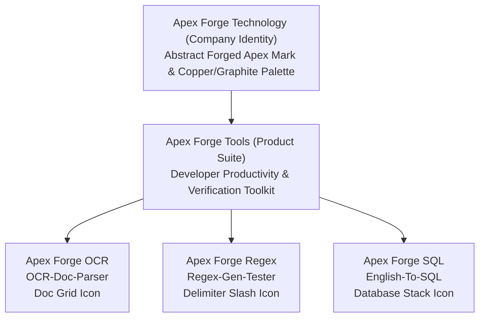

# Apex Forge Technology Brand System Specification

**Version:** 2.0.0  
**Effective Date:** 2026-09-08  
**Architecture:** Multi-Tier Engineering Brand Hierarchy (Parent Company $\rightarrow$ Product Suite $\rightarrow$ Individual Tools).

---

## 1. Brand Hierarchy Overview

---

## 2. Core Visual Principles

1. **Precision & Engineering Rigor:**  
   Clean geometry, deliberate 12-column grid alignments, consistent $8\text{px}$ rhythm, and refined typography.
2. **Subtle Forged Energy:**  
   Industrial dark graphite (`#07090e`, `#0d131f`) anchored by authentic forged-copper accents (`#ea580c`, `#f97316`) representing craft, power, and verification.
3. **Stateless Trust & Transparency:**  
   Clean badges, explicit confidence scores, execution timing displays, and contextual limitation disclaimers.

---

## 3. Design Token Schema

All web components import tokens directly from `site/design-system.css` and `brand/apex-forge/brand-tokens.json`:
- **Surface Elevation:** `--af-bg-canvas` (`#07090e`), `--af-bg-surface` (`#0d131f`), `--af-bg-raised` (`#141c2e`).
- **Interactive Accents:** `--af-copper` (`#ea580c`), `--af-copper-hover` (`#c2410c`), `--af-copper-glow` (`rgba(234, 88, 12, 0.25)`).
- **Typography:** System-safe sans stack for zero tracking and lightning sub-millisecond font rendering.
- **Focus Rings:** Accessible `--af-focus-ring` (`0 0 0 3px rgba(234, 88, 12, 0.45)`).
