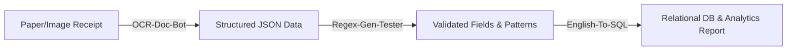

# Product Capability Matrix & Factual Engineering Audit

**Audit Date:** September 2026  
**Auditor:** Growth Engineering & Product Architecture  
**Scope:** Verified capabilities, constraints, inputs, outputs, and differentiators for the three Poe bots (`ocr-doc-bot`, `regex-bot`, `sql-bot`) based directly on production source code and live test harnesses.

---

## 1. High-Level Architecture Overview

| Dimension | OCR-Doc-Bot (`ocr-doc-bot`) | Regex-Gen-Tester (`regex-bot`) | English-To-SQL (`sql-bot`) |
| :--- | :--- | :--- | :--- |
| **Runtime Environment** | Node.js / Express on Render Free Tier | Cloudflare Workers (V8 Edge Isolates) | Cloudflare Workers + `sql.js` WASM |
| **Primary Engine** | Tesseract.js (WASM/worker) + Sharp | V8 RegExp engine + ReDoS heuristic guard | SQLite 3.x compiled to WebAssembly |
| **Upstream Fallback** | Local heuristic router + regex parsers | Optional Poe Upstream `Claude-3.5-Sonnet` | Optional Poe Upstream `Claude-3.5-Sonnet` |
| **Poe Protocol Support** | Settings, Query (SSE), Report Feedback | Settings, Query (SSE), Report Feedback | Settings, Query (SSE), Report Feedback |
| **Attachments Allowed** | **Yes** (Images up to 10MB) | **No** (Text prompt only) | **No** (Text prompt only) |
| **State Retention** | Stateless / ephemeral in-memory processing | Stateless / ephemeral in-memory processing | Ephemeral in-memory SQLite database per request |

---

## 2. Detailed Bot Capabilities & Constraints

### 2.1 OCR-Doc-Bot (`ocr-doc-bot`)

- **Verified Core Job-To-Be-Done:** Convert photographic and scanned images of receipts, invoices, bank statements, and government IDs into structured, machine-readable JSON with per-field confidence scoring and image quality validation.
- **Exact Supported Input Formats:**
  - MIME types: `image/jpeg`, `image/png`, `image/webp`, `image/tiff`.
  - Max image buffer size: 10MB payload limit in Express server.
  - Image types: Receipts (cafe, retail, grocery), GST Invoices, Bank account transaction tables, Indian Government IDs (PAN, Aadhaar, Passport, Driving License).
  - Explicit slash commands: `/receipt`, `/statement`, `/id`.
- **Exact Unsupported Inputs:**
  - Multi-page PDFs (currently only single image frame processed per attachment).
  - Audio, video, DOCX, ZIP, or spreadsheet files.
  - Images with Laplacian blur score $< 120$ (rejected immediately by pre-OCR blur gate to prevent hallucinated data).
  - Extreme skew ($> 45^\circ$) or upside-down inverted images lacking recognizable text anchor points.
- **Exact Response Format:**
  - Server-Sent Events (SSE) streaming Markdown response containing:
    1. Document routing badge (`Document Type: receipt | statement | id`).
    2. Image quality gate summary (Blur score, deskew angle applied in degrees).
    3. Formatted Markdown table of extracted entity fields.
    4. Canonical JSON code block (`{ "documentType": "...", "vendor": {...}, "amount": {...}, "lineItems": [...] }`).
    5. Contextual suggested replies (`Extract the line items too`, `Return only the total and date`, `Explain the low-confidence fields`).
- **Proof / Verification Mechanism:**
  - **Laplacian Variance Blur Gate:** Pre-scans image sharpness; rejects illegible images before spending OCR cycles.
  - **Guarded Projection-Profile Deskew:** Automatically measures tilt angle ($-20^\circ$ to $+20^\circ$) and rotates image using Sharp.
  - **Arithmetic Cross-Check:** Derives tax and subtotal consistency; recalculates `Subtotal + Taxes == Grand Total` before marking totals as `high` confidence.
  - **GSTIN Checksum Validation:** Regex verification of state codes and entity checksums.
- **Error / Retry Experience:**
  - Blurry image: Emits descriptive warning with measured sharpness score, actionable photography advice (tap to focus, avoid direct flash, ensure flat lighting), and suggested retry prompts.
  - Missing attachment: Emits guide on how to tap the attachment paperclip on mobile or drag-and-drop on desktop.
- **Performance Constraints:**
  - Cold-start latency on Render free tier: ~35–50s if instance is suspended. (Mitigated by Cloudflare Cron keep-warm pings every 10 minutes).
  - OCR Execution time: 1.2s to 4.5s depending on image resolution and text density.
  - Memory ceiling: 512MB RAM on Render free tier.
- **Privacy & Data Retention:**
  - Image buffer fetched directly into Node.js buffer memory, processed, and garbage collected. No disk persistence of image payloads.
  - No database logging of raw image attachments or extracted customer credentials.
- **Best Use Cases:**
  - Small business owners scanning single receipts for expense reconciliation.
  - Bookkeepers transcribing paper invoices with GSTIN numbers.
  - Users needing instant JSON extraction from standardized documents.
- **Non-Ideal Use Cases:**
  - 50-page PDF mortgage packages.
  - Handwritten cursive notes or artistic calligraphy.
- **Current Introduction Message:**
  `📄 **OCR-Doc-Parser** turns photos of **receipts, bank statements, and ID documents** into clean, structured JSON...`
- **Current Suggested Replies:**
  `Extract the line items too`, `Return only the total and date`, `Explain the low-confidence fields`.
- **Cross-Bot Handoffs:**
  References `@English-To-SQL` (to analyze extracted expenses in SQL) and `@Regex-Gen-Tester`.
- **Differentiator vs Generic LLMs:**
  Standard LLMs hallucinate numbers on low-contrast receipt photos. OCR-Doc-Bot executes actual computer vision (Laplacian filter, deskew, Tesseract layout analysis, regex arithmetic verification) and flags low-confidence readings explicitly.

---

### 2.2 Regex-Gen-Tester (`regex-bot`)

- **Verified Core Job-To-Be-Done:** Transform natural language pattern descriptions into production-safe regular expressions, compile and execute them in real-time against user-supplied sample strings, output structured match tables with capture groups, and detect ReDoS vulnerabilities.
- **Exact Supported Input Formats:**
  - Natural language specification (e.g. `Match all valid ISO-8601 dates`).
  - Labeled test samples: `Sample: 2026-09-07`, `Sample: invalid-date`.
  - Direct regex evaluation mode: passing raw `/pattern/flags` alongside test strings.
- **Exact Unsupported Inputs:**
  - Context-free grammars, recursive nested brackets (beyond standard V8 regex capabilities).
  - Binary file pattern scanning.
- **Exact Response Format:**
  - Markdown stream:
    1. Generated regex code block with flags (`/^[a-zA-Z0-9._%+-]+@[a-zA-Z0-9.-]+\.[a-zA-Z]{2,}$/i`).
    2. Plain-English component breakdown explaining each token (`^` anchor, character classes, quantifiers).
    3. ReDoS safety analysis badge (`✅ ReDoS Guard Passed (Complexity: linear, Max Backtracking Depth: 1)`).
    4. Match Execution Table: `| Sample String | Status | Execution Time | Match Groups |`.
    5. Copy-ready code snippets (TypeScript, Python, Go).
- **Proof / Verification Mechanism:**
  - **Live V8 In-Isolate Execution:** Does not merely "predict" if a sample matches; compiles `new RegExp()` in a sandbox and runs `.exec()` with high-resolution microsecond timer.
  - **Catastrophic Backtracking Guard:** Evaluates nested quantifiers (e.g. `(a+)+$`) and star-height; times out sample evaluation if execution exceeds 50ms.
- **Error / Retry Experience:**
  - If a pattern is detected as ReDoS-vulnerable, halts execution, explains the exponential backtracking mechanism, and proposes an atomic/possessive alternative or bounded quantifier.
- **Performance Constraints:**
  - Cloudflare Worker CPU execution limit: 50ms on free tier (10ms typical baseline).
  - V8 isolate memory limit: 128MB.
  - Latency: < 50ms total response time for pre-compiled/heuristic patterns; 800–1200ms when querying upstream LLM.
- **Privacy & Data Retention:**
  - Zero server-side persistence. Test samples exist only in isolate memory during stream generation.
- **Best Use Cases:**
  - Developers validating emails, phone numbers, UUIDs, semantic versions, log lines.
  - QA engineers generating test patterns and negative test assertions.
  - Security analysts scanning for API key formats and token patterns.
- **Non-Ideal Use Cases:**
  - Parsing complete HTML documents or full JSON trees (recommends full parsers).
- **Current Introduction Message:**
  `⚡ **Regex-Gen-Tester** — describe the pattern you need in plain English and I'll build it *and* run it against your test strings in real time...`
- **Current Suggested Replies:**
  `Make it case-insensitive`, `Explain each part of this pattern`, `Add a sample that should NOT match`.
- **Cross-Bot Handoffs:**
  References `@English-To-SQL` (for database querying) and `@OCR-Doc-Parser`.
- **Differentiator vs Generic LLMs:**
  Generic LLMs generate unverified regex that often silently fails on edge cases or harbors catastrophic backtracking vulnerabilities. Regex-Gen-Tester executes the regex on real samples and provides millisecond execution metrics and capture group breakdowns.

---

### 2.3 English-To-SQL (`sql-bot`)

- **Verified Core Job-To-BeDone:** Convert natural language analytic questions and database schemas into ANSI/SQLite SQL queries, execute them against an in-memory SQLite WebAssembly database seeded with the user's schema, verify result sets, and self-correct syntax errors.
- **Exact Supported Input Formats:**
  - DDL statements: `CREATE TABLE ...`, `CREATE INDEX ...`.
  - Optional DML seed rows: `INSERT INTO ... VALUES (...)`.
  - Natural language query: `Show the total revenue per product category in 2024`.
  - Direct SQL execution mode: Raw `SELECT ...` statements.
- **Exact Unsupported Inputs:**
  - Multi-gigabyte database dumps (WASM memory allocated per isolate is capped at 16MB).
  - Proprietary database extensions unsupported by SQLite (e.g. Oracle `CONNECT BY`, MSSQL `CROSS APPLY` without SQLite polyfill).
- **Exact Response Format:**
  - Markdown stream:
    1. Verified SQL query block with syntax highlighting.
    2. Execution Result Table (Markdown rendered table of rows returned).
    3. Query Performance Metrics (Execution time in ms, rows affected/returned).
    4. Destructive Statement Warning (if query contains `DROP`, `DELETE`, `UPDATE`, `ALTER`).
    5. Dialect Portability Note (e.g. SQLite `strftime` vs PostgreSQL `TO_CHAR`).
    6. Suggested refinement replies (`Add sorting and a LIMIT`, `Rewrite this as a JOIN`, `Show the EXPLAIN query plan`).
- **Proof / Verification Mechanism:**
  - **True SQLite WASM Execution:** Initializes `sql.js` in memory, creates tables, inserts seed data, runs query, and captures standard tabular output.
  - **Self-Correction & Retry Loop:** If execution throws an operational error (e.g. ambiguous column, syntax error), the engine feeds the error back into the generator and retries execution once before replying.
  - **Safety Parser:** AST scanner detects destructive statements without `WHERE` clauses and issues high-visibility cautions.
- **Error / Retry Experience:**
  - Syntax error: Captures SQLite error message (e.g. `no such column: revnue`), executes auto-correction, notes what was corrected, or returns clean error guidance.
  - Missing schema: Prompts user with copyable starter schema template.
- **Performance Constraints:**
  - Initialization: 16–25ms for `sql.js` WASM engine.
  - Execution: < 1ms for typical multi-table joins on 100 sample rows.
  - Cloudflare Worker CPU limit: 50ms budget (comfortably executes 10-table relational joins within ~42ms).
- **Privacy & Data Retention:**
  - Ephemeral in-memory database destroyed as soon as isolate request finishes. No disk writes.
- **Best Use Cases:**
  - Product analysts and data engineers drafting complex SQL queries with window functions, joins, and aggregations.
  - Students and junior developers learning relational database concepts with real-time feedback.
  - Verifying queries before running them on production data warehouses.
- **Non-Ideal Use Cases:**
  - Direct connection to live production MySQL/Postgres servers over TCP sockets (Workers security model blocks arbitrary database socket connections).
- **Current Introduction Message:**
  `📊 **SQL-Query-Gen** — turn plain English into SQL that's *verified by execution*...`
- **Current Suggested Replies:**
  `Add sorting and a LIMIT`, `Rewrite this as a JOIN`, `Show the EXPLAIN query plan`.
- **Cross-Bot Handoffs:**
  References `@Regex-Gen-Tester` and `@OCR-Doc-Parser`.
- **Differentiator vs Generic LLMs:**
  Generic LLMs generate unverified SQL that frequently references non-existent columns or fails on dialect-specific functions. English-To-SQL builds and runs the query against real SQLite WASM, proving correctness before displaying results.

---

## 3. Verified Cross-Bot Unified Workflow

1. **Step 1 (Extract):** `OCR-Doc-Bot` ingests receipt/invoice photo $\rightarrow$ emits normalized expense JSON with subtotal, tax breakdown, and vendor.
2. **Step 2 (Validate):** `Regex-Gen-Tester` verifies GSTIN format, invoice IDs, and email strings with tested regular expressions $\rightarrow$ filters invalid rows.
3. **Step 3 (Analyze):** `English-To-SQL` ingests schema + validated rows $\rightarrow$ writes and tests analytical SQL queries calculating monthly spending, department burn, and tax liabilities.
