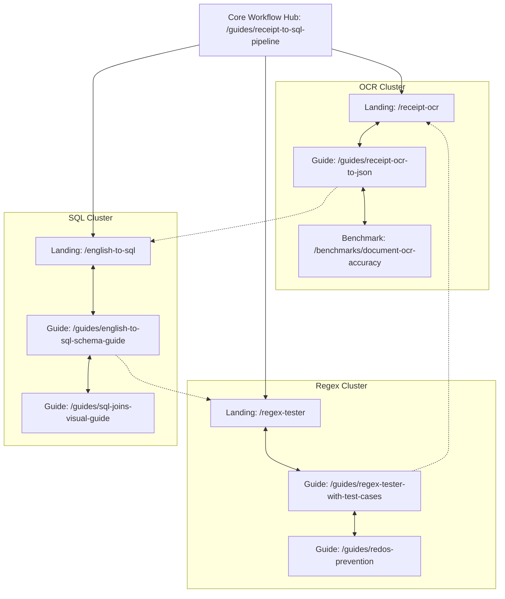

# Internal Linking Architecture & Page Relationship Map

**Author:** SEO Director  
**Scope:** Structured internal link graph connecting core landing pages, benchmark reports, guides, and cross-bot workflow hubs.

---

## 1. Hub-and-Spoke Link Topology

---

## 2. Inbound & Outbound Link Matrix

| Page URL | Inbound Link Sources | Outbound Links (Required) | Anchor Text Standard |
| :--- | :--- | :--- | :--- |
| `/receipt-ocr` (Pillar) | Homepage, Navigation, `/guides/receipt-ocr-to-json`, `/guides/receipt-to-sql-pipeline` | `/benchmarks/document-ocr-accuracy`, `poe.com/OCR-Doc-Parser`, `/english-to-sql` | "receipt OCR to JSON", "test receipt on Poe" |
| `/regex-tester` (Pillar) | Homepage, Navigation, `/guides/regex-tester-with-test-cases`, `/guides/redos-prevention` | `poe.com/Regex-Gen-Tester`, `/english-to-sql`, `/guides/redos-prevention` | "safe regex generator", "test regex live on Poe" |
| `/english-to-sql` (Pillar) | Homepage, Navigation, `/guides/english-to-sql-schema-guide`, `/guides/sql-joins-visual-guide` | `poe.com/English-To-SQL`, `/regex-tester`, `/guides/english-to-sql-schema-guide` | "convert English to SQL", "run SQL on Poe" |
| `/benchmarks/document-ocr-accuracy` | `/receipt-ocr`, `/guides/receipt-ocr-to-json` | `/receipt-ocr`, `poe.com/OCR-Doc-Parser` | "view OCR accuracy benchmark", "try verified OCR" |
| `/guides/receipt-to-sql-pipeline` | All 3 pillar pages, Homepage footer | `/receipt-ocr`, `/regex-tester`, `/english-to-sql` | "extract and analyze workflow", "3-step data pipeline" |

---

## 3. Crawl Depth & Anchor Text Invariants

1. **Max Crawl Depth:** Every page on the site must be accessible within **2 clicks** from the homepage.
2. **Descriptive Anchor Text:** Never use "click here", "read more", or generic phrases. Always include the entity or target keyword (e.g. `[review our 16-case OCR accuracy benchmark](...)`).
3. **No Orphan Pages:** Every new content brief must specify at least two inbound links from existing pages before publishing.
