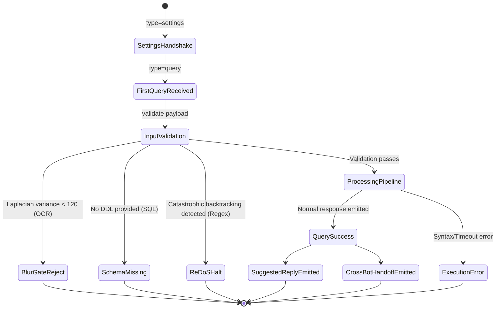

# Privacy-Safe Telemetry & Analytics Specification

**Author:** Analytics Lead & Data Protection Officer  
**Scope:** Telemetry event schemas, funnel instrumentation, data collection constraints, and zero-PII privacy guarantees across all three Poe bots.

---

## 1. Privacy & Data Protection Guarantees (Zero-PII Architecture)

Enterprise document intelligence and developer utilities often handle sensitive documents (receipts, bills, tax identifiers) and proprietary code. To maintain trust and comply with GDPR, CCPA, and Poe Creator policies, our analytics architecture enforces a **Zero-PII Invariant**:

### Strictly Prohibited Data (Never Collected or Logged):
1. **Raw Authentication Tokens & Access Keys:** Stripped before logging.
2. **Document Image URLs & Payloads:** Temporary attachment URLs signed by Poe are never stored or logged in telemetry.
3. **Raw OCR Output & Extracted Text:** Vendor names, customer names, line item descriptions, and addresses are discarded immediately after SSE transmission.
4. **Financial Identifiers:** Full credit card numbers, CVVs, bank account numbers, IFSC codes, and Aadhaar numbers.
5. **Raw User Prompts & Test Samples:** Developer regex test strings and SQL schema column values.

---

## 2. Event Taxonomy & Minimum Event Schema

All events adhere to a structured, categorical JSON schema. Telemetry is emitted to `stdout` as structured JSON or piped to an in-memory aggregation buffer.

### 2.1 Core Event: `bot_query_completed`

```json
{
  "event_name": "bot_query_completed",
  "bot": "ocr-doc-bot",
  "request_id": "9b1deb4d-3b7d-4bad-9bdd-2b0d7b3dcb6d",
  "timestamp": "2026-09-07T09:30:00.000Z",
  "outcome": "success",
  "latency_bucket": "3-10s",
  "route": "receipt",
  "confidence_bucket": "high",
  "error_category": "none",
  "suggested_replies_emitted": 3,
  "cross_bot_handoff_emitted": true,
  "arithmetic_verified": true,
  "blur_score_tier": "sharp"
}
```

### 2.2 Allowed Categorical Values

| Field | Type | Allowed Values / Buckets |
| :--- | :--- | :--- |
| `event_name` | String | `bot_query_completed`, `bot_settings_loaded`, `feedback_received` |
| `bot` | String | `ocr-doc-bot`, `regex-bot`, `sql-bot` |
| `outcome` | String | `success`, `partial`, `failure` |
| `latency_bucket` | String | `<1s`, `1-3s`, `3-10s`, `>10s` |
| `route` | String | `receipt`, `statement`, `id`, `regex_eval`, `sql_query`, `unknown` |
| `confidence_bucket`| String | `high`, `medium`, `low`, `none` |
| `error_category` | String | `none`, `auth`, `input_missing`, `image_blurred`, `ocr_empty`, `syntax_error`, `redos_rejected`, `upstream_timeout` |
| `blur_score_tier` | String | `sharp` ($> 300$), `acceptable` ($120–300$), `blurred` ($< 120$) |

---

## 3. Funnel Instrumentation Points



1. **Top-of-Funnel:** `type=settings` handshake logged as `bot_settings_loaded`. Measures active bot visibility in Poe client.
2. **Engagement Initiation:** `type=query` received. Measures query arrival rate.
3. **Quality & Recovery Gate:** Logs rejection reason categories (`image_blurred`, `no_schema`, `redos_rejected`).
4. **Completion:** Emits `bot_query_completed` with latency and confidence categorization.
5. **Feedback Capture:** `type=report_feedback` records like/dislike counts grouped by route, without recording user identities.
