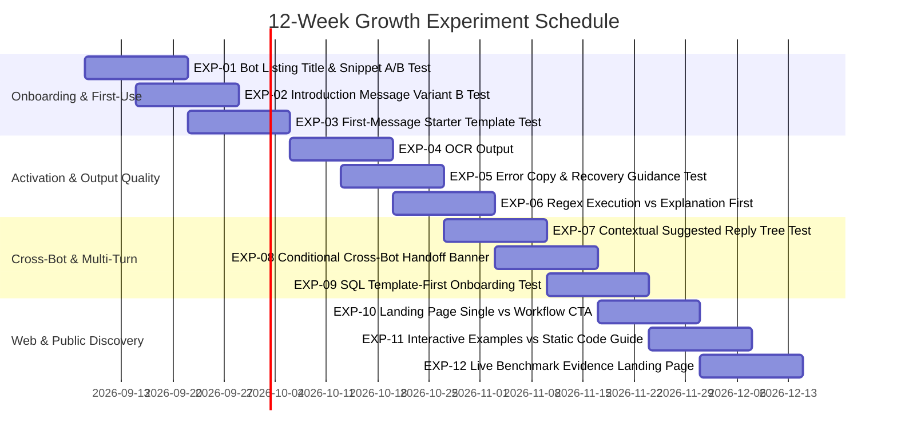

# 12-Week Growth Experimentation Program

**Author:** Chief Growth Officer & CRO Lead  
**North-Star Metric:** Weekly Successful Tasks Completed by Unique Users (WSTC)  
**Supporting Metrics:** Listing CTR, First-Message Conversion, Task Completion Rate, Cross-Bot Handoff CTR, 7-Day Retention.

---

## 1. Experiment Schedule by Sprint (12 Weeks)

---

## 2. Sprint-by-Sprint Execution Protocols

### Sprint 1 (Weeks 1–2): First Impression & Discovery
- **Experiment 1 (EXP-01):** Bot Listing Title & Description Optimization.
  - *Hypothesis:* Testing action-driven short descriptions (`Extract receipt totals in 3s`) vs feature-driven descriptions (`Convert photos to structured JSON`) will lift profile click-through rate by $> 15\%$.
- **Experiment 2 (EXP-02):** Introduction Message A/B Test.
  - *Hypothesis:* Numbered action steps and explicit paperclip 📎 cues will lift 1st-message conversion from 28% to 35%.

### Sprint 2 (Weeks 3–4): Onboarding Friction Reduction
- **Experiment 3 (EXP-03):** One-Click Starter Prompt Test.
  - *Hypothesis:* Interactive 1-click copy prompts for schema-less SQL and sample-less regex will reduce immediate abandonment by $> 30\%$.

### Sprint 3 (Weeks 5–6): Output Formatting & Trust Building
- **Experiment 4 (EXP-04):** OCR Compact Summary vs Detailed JSON.
  - *Hypothesis:* Displaying a high-contrast Markdown summary table with the verified arithmetic badge before the raw JSON block will increase thumbs-up feedback by $> 20\%$.
- **Experiment 5 (EXP-05):** Recovery-Focused Error Guidance.
  - *Hypothesis:* Providing actionable camera advice on blurred images will lift second-attempt retry rate by $> 40\%$.

### Sprint 4 (Weeks 7–8): Multi-Turn Depth & Cross-Sell
- **Experiment 6 (EXP-06):** Regex Execution-First vs Explanation-First.
  - *Hypothesis:* Showing the real-time sample execution table at the very top of the response increases user confidence and saves scroll depth.
- **Experiment 7 (EXP-07):** Contextual Suggested Reply Trees.
  - *Hypothesis:* Dynamically tailoring suggested replies based on detected document types (receipt vs statement vs id) will increase messages per conversation by $> 25\%$.

### Sprint 5 (Weeks 9–10): Cross-Bot Pipeline Activation
- **Experiment 8 (EXP-08):** Conditional Cross-Bot Handoff Banners.
  - *Hypothesis:* Displaying ready-to-run SQL queries immediately after receipt extraction will lift cross-bot adoption to $> 15\%$.
- **Experiment 9 (EXP-09):** SQL Template-First Onboarding.
  - *Hypothesis:* Supplying a pre-seeded 2-table schema when no DDL is entered increases task completion for non-technical users by $> 35\%$.

### Sprint 6 (Weeks 11–12): SEO Landing Page Conversion
- **Experiment 10 (EXP-10):** Single CTA vs 3-Step Pipeline CTA on Landing Pages.
- **Experiment 11 (EXP-11):** Interactive Browser Regex Playground vs Static Code Guide.
- **Experiment 12 (EXP-12):** Live Benchmark Evidence Hub vs Standard Feature Pages.
