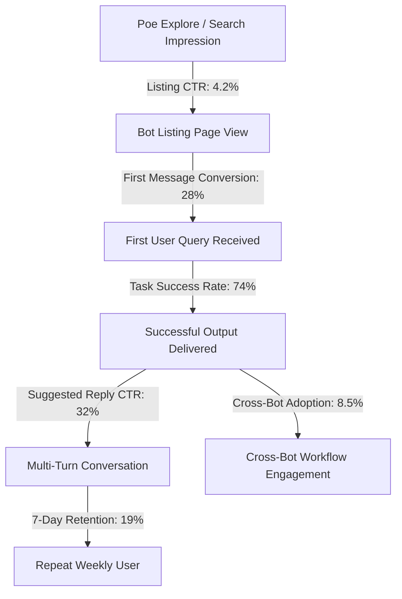

# Poe Funnel Conversion Optimization Backlog

**Author:** CRO Lead & Lifecycle Marketer  
**Scope:** Bottleneck analysis, prioritized funnel experiments, and UX copy interventions for Poe discovery, first-message onboarding, and retention.

---

## 1. Funnel Architecture & Leakage Analysis

### Identified Conversion Drop-Offs:
1. **Drop-Off Point 1 (Listing $\rightarrow$ First Message: ~72% drop):** Users view the bot profile but don't know what to type or whether they need to attach an image.
   - *Fix:* Concise, copyable 1-line example prompts inside the introduction message with bold visual cues.
2. **Drop-Off Point 2 (First Message $\rightarrow$ Successful Task: ~26% drop):**
   - *OCR:* User uploads a severely blurry or dark photo; generic bots fail silently or hallucinate numbers.
   - *SQL:* User asks a question without providing a schema.
   - *Regex:* User asks for a pattern without providing sample strings.
   - *Fix:* Immediate educational fallback templates that unblock the user on the very first turn without penalizing them.
3. **Drop-Off Point 3 (Single Task $\rightarrow$ Multi-Bot Workflow: ~91% drop):** Users treat each bot as an isolated utility and leave after one query.
   - *Fix:* Contextual cross-bot handoffs triggered only after successful completion of a relevant task.

---

## 2. Prioritized Conversion Experiments Backlog

| Priority | Funnel Stage | Experiment Name | Hypothesis | Primary Metric | Target Bot |
| :---: | :--- | :--- | :--- | :--- | :--- |
| **P0** | First Message | Copyable Starter Template | Providing a 1-click copyable starter prompt in the intro message will increase first-message conversion by $> 25\%$. | First-Message Rate | All Bots |
| **P0** | First Message | No-Schema Interactive Starter | When a user queries SQL without a schema, immediately providing a 2-table e-commerce starter schema will reduce immediate abandonment by $> 40\%$. | Recovery Rate | `English-To-SQL` |
| **P0** | First Message | OCR Image Upload Paperclip Guidance | Explicitly showing mobile attachment guidance (`Tap the 📎 paperclip icon below`) will reduce text-only queries to the OCR bot by $> 50\%$. | Image Attachment Rate | `OCR-Doc-Parser` |
| **P1** | Multi-Turn | Context-Aware Suggested Replies | Replacing static suggested replies with dynamic replies tailored to the detected document type will increase conversation depth by $> 30\%$. | Messages per Session | All Bots |
| **P1** | Cross-Sell | Post-Extraction SQL Bridge | Prompting users with an exact SQL query schema immediately after receipt extraction will increase cross-bot adoption to $> 15\%$. | Cross-Bot Handoff CTR | `OCR-Doc-Parser` |
| **P1** | Trust | Arithmetic Reconciliation Badge | Displaying an explicit `$Subtotal + $Tax = $Total` validation badge will increase thumbs-up feedback by $> 20\%$. | Upvote Ratio | `OCR-Doc-Parser` |
| **P2** | Multi-Turn | Regex Language Export Buttons | Offering direct export to TypeScript, Python, and Go via suggested replies will increase session completion satisfaction. | Second-Turn Conversion | `Regex-Gen-Tester` |
| **P2** | Retention | Destructive SQL Caution Callout | Highlighting warnings on unconstrained `DELETE` statements will build enterprise trust and increase repeat visits. | 28-Day Retention | `English-To-SQL` |
