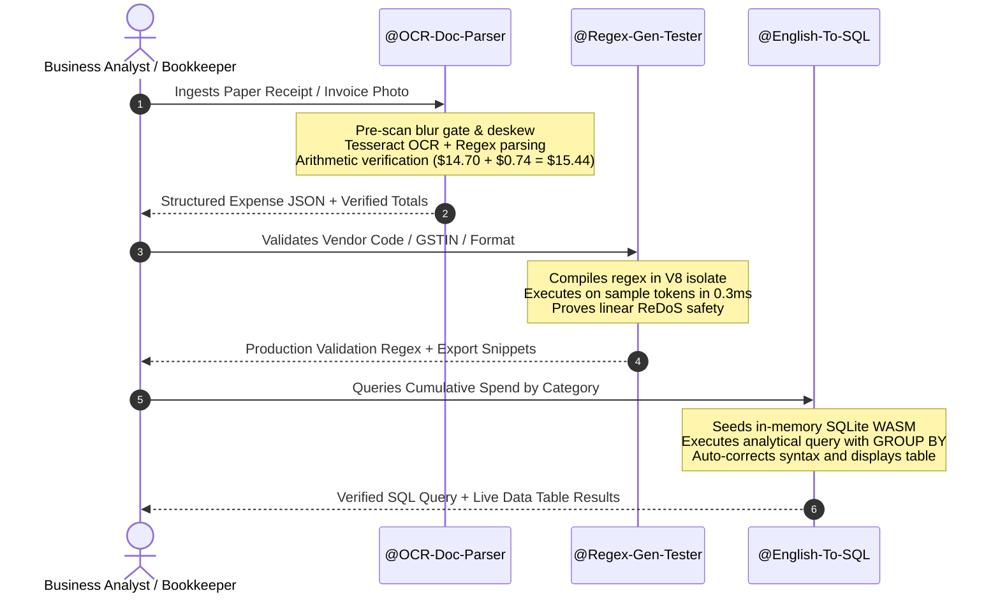

# Unified Cross-Bot Workflow Architecture

**Author:** Head of Product Marketing & Growth Engineering  
**Scope:** The end-to-end "Extract $\rightarrow$ Validate $\rightarrow$ Analyze" customer workflow connecting `OCR-Doc-Parser`, `Regex-Gen-Tester`, and `English-To-SQL`.

---

## 1. The Core Enterprise Document Workflow

Many business users encounter disconnected tools: one tool to scan receipts, another tool to write regex validation scripts, and a third tool to write database queries. Our three bots are positioned as **one integrated data pipeline**:



---

## 2. Transition Point 1: OCR $\rightarrow$ SQL (Expense Intelligence)

### Trigger Event
A user has just successfully extracted a cafe receipt or supermarket invoice with line items, tax breakdown, and total.

### Bot Response Handoff Banner (Emitted by OCR Bot)
```markdown
---
💡 **Next Step in Your Workflow:**
Want to aggregate and analyze these expenses? Use **@English-To-SQL** to query spending across vendors.

**Copy this prompt into @English-To-SQL:**
```sql
CREATE TABLE expenses (vendor TEXT, date DATE, subtotal DECIMAL, tax DECIMAL, total DECIMAL);
INSERT INTO expenses VALUES ('ARTISAN ROAST CAFE', '2024-10-14', 14.70, 0.74, 15.44);
-- Which vendors account for over 30% of our quarterly spending?
```
```

### Conversion Rationale
Instead of leaving the user with raw JSON that requires manual copying, we provide the exact schema and `INSERT` statement ready to run in `English-To-SQL`.

---

## 3. Transition Point 2: SQL $\rightarrow$ Regex (Data Sanitization)

### Trigger Event
A user is writing a query in `English-To-SQL` filtering string columns (e.g. `WHERE email LIKE '%@%'` or `WHERE phone LIKE '+%'`).

### Bot Response Handoff Banner (Emitted by SQL Bot)
```markdown
---
💡 **Data Quality Recommendation:**
SQLite's `LIKE` operator only handles simple wildcards. For robust data validation before inserting rows into this table, use **@Regex-Gen-Tester** to generate and test strict format patterns (E.164 phone numbers, UUIDs, RFC-5322 emails) with catastrophic backtracking safety checks.
```

### Conversion Rationale
Demonstrates engineering integrity by acknowledging SQLite's native regex limitations and pointing directly to our dedicated regex evaluation engine.

---

## 4. Transition Point 3: Regex $\rightarrow$ OCR (Document Verification)

### Trigger Event
A developer is generating regular expressions in `Regex-Gen-Tester` to match complex document identifiers (e.g. Indian GSTIN, PAN numbers, Passport MRZ lines).

### Bot Response Handoff Banner (Emitted by Regex Bot)
```markdown
---
💡 **Processing Scanned Paper Documents?**
If you need to extract these identifiers directly from camera photos or scanned invoices, try **@OCR-Doc-Parser**. It auto-corrects orientation tilt, checks for camera blur, and parses GSTIN and invoice lines into structured JSON.
```

### Conversion Rationale
Connects the developer working on document validation logic back to the real-world intake pipeline.

---

## 5. Technical Architecture for Cross-Bot Discovery

1. **Category Adjacency:**
   - `English-To-SQL` and `Regex-Gen-Tester` share the **Programming** category on Poe.
   - `OCR-Doc-Parser` is in **Productivity**.
2. **Poe "Related Recommendations" Synergies:**
   - Poe's algorithm computes co-usage affinity. By providing immediate copy-paste prompts between bots, we guide the user to hold conversations with multiple bots in the same session, boosting the co-recommendation coefficient.
3. **Cross-Bot Link Syntax:**
   - We use the official Poe `@<Handle>` mention syntax in introduction messages and suggested replies, ensuring clickable navigation within the Poe native mobile app and web client.
