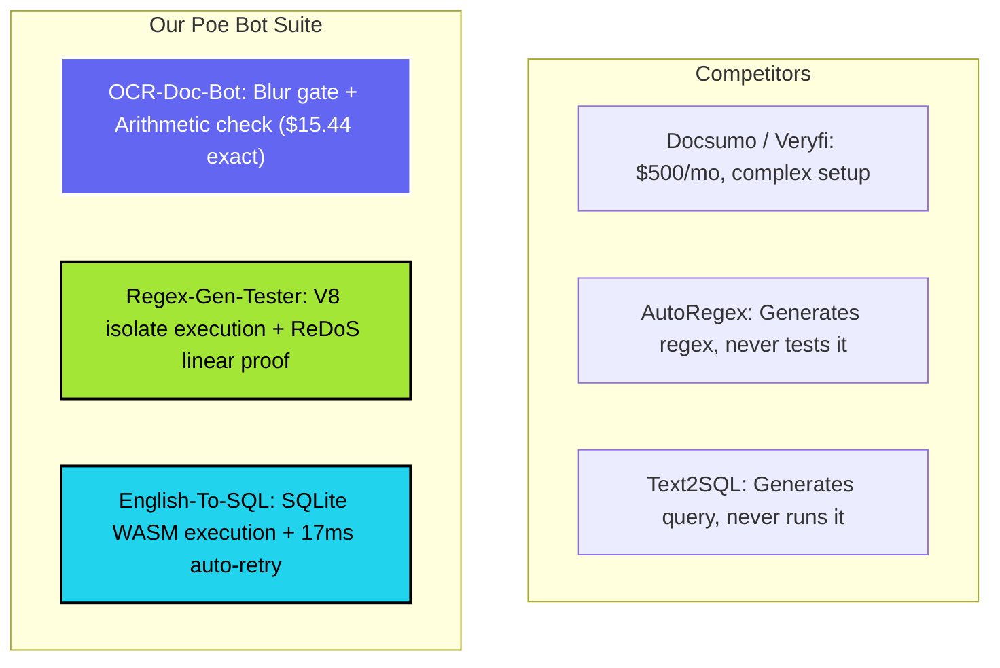

# Competitor Landscape & Differentiation Matrix

**Author:** Head of Product Marketing & SEO Director  
**Scope:** Competitive feature, pricing, weakness, and opportunity analysis across Document OCR, Regex Generation/Testing, and Text-to-SQL.

---

## 1. Document & Receipt OCR Competitors

| Category | Competitor | Primary User | Core Promise | Key Features | Weakness / Gap | Pricing Model | Content Strategy | Opportunity for Our Bot |
| :--- | :--- | :--- | :--- | :--- | :--- | :--- | :--- | :--- |
| **Receipt OCR** | **Veryfi Lens** | Mobile app developers & enterprise finance | Instant mobile receipt scanning via SDK | Mobile camera edge SDK, receipt line-item extraction, currency detection | High enterprise cost ($500+/mo minimum commit), complex enterprise sales process, no free conversational interface | Paid enterprise SaaS (tier based on doc volume) | Whitepapers, compliance PDFs, high-volume API docs | Provide instant, free conversational receipt parsing with per-field confidence flags directly on Poe |
| **Document OCR** | **Docsumo / Nanonets** | Operations & back-office automation teams | Automated invoice data extraction | Table parsing, workflow validation, human-in-the-loop review UI | Complex UI setup, requires extensive template training, gated behind sales demos | Freemium ($0.10–$0.30 per page after trial) | High-volume programmatic SEO for document templates | Zero-friction direct image upload; instant arithmetic validation without signing up for complex software |
| **General AI Vision** | **ChatGPT Plus (GPT-4o)** | General consumers & casual users | Universal image comprehension | Vision chat, generic text extraction | **Hallucinates financial totals on blurry images**; no explicit blur gate; no confidence breakdown; no arithmetic derivation proof | $20/month subscription | Broad mainstream social media & product marketing | Focus on strict mathematical reconciliation ($Subtotal + Tax = Total$) and explicit rejection of illegible scans |

---

## 2. Regex Generation & Testing Competitors

| Category | Competitor | Primary User | Core Promise | Key Features | Weakness / Gap | Pricing Model | Content Strategy | Opportunity for Our Bot |
| :--- | :--- | :--- | :--- | :--- | :--- | :--- | :--- | :--- |
| **Regex Sandbox** | **Regex101** | Software developers & engineers | Interactive regex editor and debugger | Real-time syntax highlighting, regex tree explanation, single-test string runner | Does not generate regex from plain English; requires manual copy-pasting of individual test strings; ReDoS detection is limited | Ad-supported free web tool | Community regex library, high domain authority | Provide conversational English-to-Regex generation paired with automatic batch test sample execution and microsecond benchmarks |
| **AI Regex Builder** | **AutoRegex / AI Regex Tools** | Non-technical users & junior devs | Convert plain English to regular expressions | Web form with prompt box, outputs raw regex string | **Does not run the generated regex against test strings**; frequently outputs unanchored or ReDoS-vulnerable patterns; zero execution proof | Freemium / Ad-supported / Token credits | Thin programmatic SEO pages targeting "regex for [x]" | Execute every regex live against user samples in edge isolates, displaying capture groups and ReDoS linear proof |
| **General AI Coding** | **GitHub Copilot / Claude Chat** | Professional software developers | Code autocompletion in IDE or chat | Inline regex suggestions in code editors | Suggests pattern without verifying against negative edge cases; developer must manually write unit tests to confirm safety | $10–$20/month developer subscription | Developer conferences, technical documentation | Deliver instant multi-sample match tables with microsecond timing and language-specific export snippets |

---

## 3. Text-to-SQL & SQL Playground Competitors

| Category | Competitor | Primary User | Core Promise | Key Features | Weakness / Gap | Pricing Model | Content Strategy | Opportunity for Our Bot |
| :--- | :--- | :--- | :--- | :--- | :--- | :--- | :--- | :--- |
| **Online Playground** | **DB Fiddle / SQL Fiddle** | Database administrators & students | Online SQL testing across database engines | In-browser schema creation and query execution across Postgres/MySQL/SQLite | No AI generation; user must write all SQL manually; slow UI; cumbersome for quick questions | Ad-supported free web tool | Forum answers, StackOverflow link sharing | Combine natural-language question asking with automatic schema seeding and instant WASM execution |
| **AI SQL Tool** | **Text2SQL.ai / AI2sql** | Marketers, product managers, junior analysts | Generate SQL queries from natural language | Web UI prompt-to-SQL generator | **Generates query without executing it**; cannot verify whether syntax matches schema; misses column typos; zero runtime error correction | $7–$29/month subscription | Programmatic landing pages for "how to write sql for [x]" | Actually run the query inside ephemeral SQLite WASM, proving correctness with returned data tables and self-correcting errors |
| **Enterprise BI** | **Vanna.ai / Metabase AI** | Corporate data teams & data engineers | Open-source/hosted RAG for database querying | Trains on existing data warehouse schemas, connects to live databases | Requires database connection setup, infrastructure maintenance, and complex security onboarding | Open-source core + enterprise hosting tiers | Technical documentation, GitHub repository growth | Zero-setup, instant ad-hoc query validation using pure in-memory edge execution without needing database credentials |

---

## 4. Key Differentiators Summary

