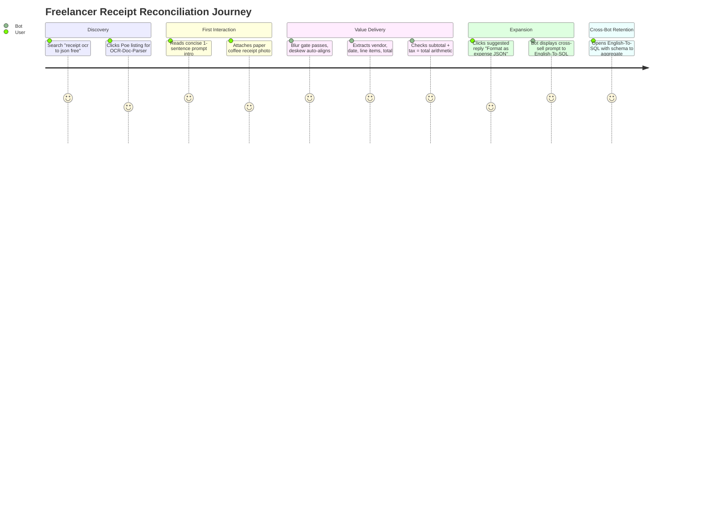
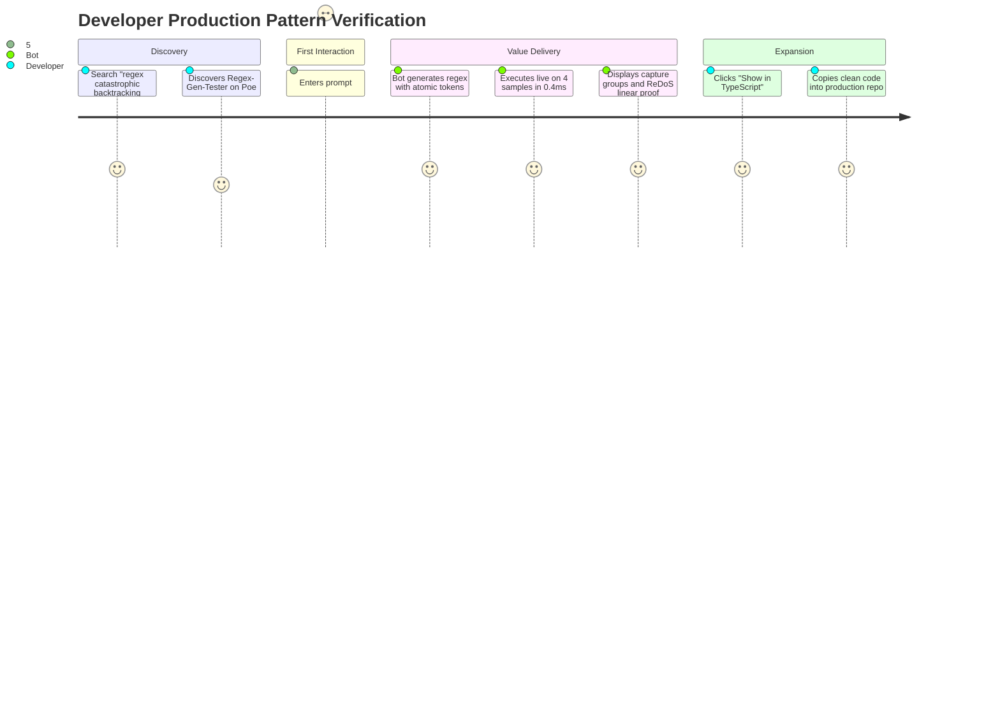
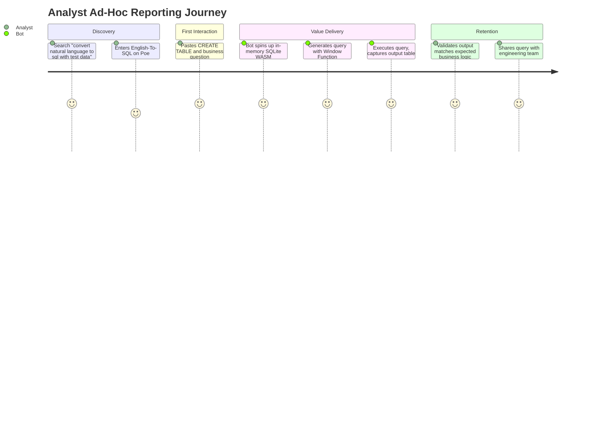

# User Journey Maps & Search Intent Taxonomy

**Author:** Head of Product Marketing & SEO Director  
**Scope:** Multi-touchpoint conversion journeys for each bot, search intent clustering across 9 query archetypes, and multi-bot workflow transitions.

---

## 1. End-to-End User Journey Maps

### Journey 1: The Freelancer Expense Extraction (`OCR-Doc-Bot` $\rightarrow$ `English-To-SQL`)

1. **Awareness / Search:** User is preparing quarterly accounts; searches `extract receipt details from image`. Lands on Poe listing `poe.com/OCR-Doc-Parser`.
2. **First Interaction (Aha! Moment):** Taps attachment icon, uploads a slightly tilted cafe receipt photo. The bot auto-deskews the image, validates the Laplacian sharpness, and outputs a formatted table and canonical JSON with exact $15.44 total in < 3.5 seconds.
3. **Trust Solidification:** User notices the badge: `Arithmetic check passed ($14.70 + $0.74 = $15.44)`. User realizes this is an actual verified OCR engine, not a hallucinating chatbot.
4. **Handoff:** Bot emits contextual suggested reply: *"Analyze receipts in SQL"*. User taps to launch `English-To-SQL` and aggregates multi-receipt expenses by category.

---

### Journey 2: The Developer Regex Validation (`Regex-Gen-Tester` $\rightarrow$ `English-To-SQL`)

1. **Awareness / Search:** Developer encounters an intermittent regex hang in their Node.js API; searches `safe regex generator plain english`.
2. **First Interaction (Aha! Moment):** Pastes requirement and 3 sample strings. The bot compiles the pattern in an edge V8 isolate, executes against the samples, and outputs an execution timing table with microsecond latency metrics.
3. **Trust Solidification:** The bot explicitly highlights the ReDoS safety check: `Complexity: Linear O(N). No nested quantifiers detected.`
4. **Handoff:** When developer mentions importing validated data to their PostgreSQL warehouse, bot suggests `@English-To-SQL` to generate verified table constraints.

---

### Journey 3: The Data Analyst Ad-Hoc Report (`English-To-SQL` $\rightarrow$ `Regex-Gen-Tester`)

1. **Awareness / Search:** Analyst needs to write a customer retention cohort query with `DENSE_RANK()`; searches `english to sql with schema`.
2. **First Interaction (Aha! Moment):** Pastes two `CREATE TABLE` statements. The bot instantiates `sql.js` WASM, executes the query, and displays the resulting tabular data directly in the response.
3. **Trust Solidification:** The engine catches a minor alias syntax issue, auto-corrects in 17ms, and states: `Self-corrected query successfully verified against in-memory SQLite engine`.
4. **Handoff:** To clean incoming raw email fields before running joins, the bot suggests `@Regex-Gen-Tester`.

---

## 2. Comprehensive Search Intent Taxonomy

### Category 1: OCR-Doc-Bot Search Intent Taxonomy

| Intent Archetype | User Search Queries | User Goal | Content / Bot Landing Page Asset | Target Conversion CTA |
| :--- | :--- | :--- | :--- | :--- |
| **Informational** | "how does receipt ocr work", "tesseract receipt parsing accuracy" | Understand optical character recognition technology | Guide: *How OCR Layout Engines Parse Receipts* | "Test Your Receipt Image on Poe" |
| **Problem-Aware** | "blurry receipt ocr fix", "receipt text unreadable on scan" | Overcome camera blur and lighting degradation | Article: *How to Photograph Receipts for High-Accuracy OCR* | "Scan Blurry Receipt with Auto-Deskew" |
| **Solution-Aware** | "extract receipt details from image", "invoice data extraction example" | Find a tool that turns images into structured fields | Solution Page: `/receipt-ocr` | "Extract Receipt JSON Free on Poe" |
| **Tool-Intent** | "receipt ocr to json", "bank statement table extraction online" | Instant task execution with file attachment | Tool Interface: `/receipt-ocr` | "Launch OCR-Doc-Parser Bot" |
| **Comparison** | "best free receipt ocr tools 2026", "tesseract vs ai vision for receipts" | Evaluate accuracy, privacy, and speed | Benchmark: *Live Document OCR Accuracy Evaluation* | "Try Our Zero-Hallucination OCR" |
| **Template / Example** | "expense json schema receipt", "receipt ocr output example" | Obtain standard schema for accounting integrations | Template: *Standardized Expense JSON Schema* | "Generate Expense JSON from Photo" |
| **Troubleshooting** | "why did receipt total ocr fail", "handle thermal paper fade ocr" | Debug misread amounts and missing taxes | Guide: *How to Reconcile Failed Receipt Extractions* | "Upload to Test Confidence Scorer" |
| **Educational** | "gst invoice fields required for input credit", "ocr confidence score meaning" | Learn statutory tax invoice requirements | Documentation: *GSTIN Validation & Invoice Field Guide* | "Verify GST Invoice on Poe" |
| **High-Conversion** | "scan receipt get tax and total free", "receipt parser for excel" | Immediate workflow completion | Direct Poe Bot Listing | "Upload Receipt Image Now" |

---

### Category 2: Regex-Gen-Tester Search Intent Taxonomy

| Intent Archetype | User Search Queries | User Goal | Content / Bot Landing Page Asset | Target Conversion CTA |
| :--- | :--- | :--- | :--- | :--- |
| **Informational** | "how regular expressions work", "regex capture groups explained" | Understand regex engine mechanics | Guide: *Mastering Regex Capture Groups & Lookaheads* | "Test Your Patterns in Real-Time" |
| **Problem-Aware** | "why does my regex cause 100% cpu", "prevent catastrophic backtracking" | Debug ReDoS outages in production | Article: *What is ReDoS and How to Prevent It* | "Scan Your Regex for ReDoS" |
| **Solution-Aware** | "regex generator with test cases", "plain english to regex builder" | Generate a reliable regex from text | Solution Page: `/regex-tester` | "Generate & Test Regex on Poe" |
| **Tool-Intent** | "regex tester with sample table", "test regex online against multiple strings" | Run regex across 5+ positive/negative samples | Tool Interface: `/regex-tester` | "Launch Regex-Gen-Tester Bot" |
| **Comparison** | "regex101 alternatives with batch testing", "ai regex generator comparison" | Find tools that execute rather than just guess | Benchmark: *AI Regex Generators: Execution vs Guessing* | "Run Verified Regex on Poe" |
| **Template / Example** | "email regex for form validation", "uuid v4 regex pattern typescript" | Copy proven, battle-tested regex patterns | Library: *Production Regex Pattern Library (Tested)* | "Customize This Regex on Poe" |
| **Troubleshooting** | "why is my regex not matching", "fix javascript regex lookbehind error" | Identify missing flags, bad escapes, or boundary bugs | Guide: *Regex Debugging Checklist for Developers* | "Debug Your Pattern with Live Execution" |
| **Educational** | "when not to use regex", "regex vs parsing html" | Understand technical limitations of regular languages | Guide: *When Regex Fails: Context-Free Grammars* | "Test Pattern Safety on Poe" |
| **High-Conversion** | "safe regex generator plain english", "email regex tester online" | Solve immediate coding task | Direct Poe Bot Listing | "Generate & Run Regex Now" |

---

### Category 3: English-To-SQL Search Intent Taxonomy

| Intent Archetype | User Search Queries | User Goal | Content / Bot Landing Page Asset | Target Conversion CTA |
| :--- | :--- | :--- | :--- | :--- |
| **Informational** | "how text to sql works", "sqlite vs postgresql syntax differences" | Learn automated query generation fundamentals | Guide: *How Schema-Seeded In-Memory SQL Engines Work* | "Run Queries in SQLite WASM" |
| **Problem-Aware** | "ai generated sql query syntax error", "how to test sql without production db" | Safely test AI queries before production execution | Article: *The Danger of Unverified AI SQL Queries* | "Verify Queries in Ephemeral DB" |
| **Solution-Aware** | "english to sql with schema", "convert natural language to sql with test data" | Generate SQL from DDL schema definitions | Solution Page: `/english-to-sql` | "Generate Verified SQL on Poe" |
| **Tool-Intent** | "sql query generator and runner", "debug sql query online sqlite" | Generate, execute, and view table results | Tool Interface: `/english-to-sql` | "Launch English-To-SQL Bot" |
| **Comparison** | "best text to sql tools for analysts", "chatgpt vs execution verified sql" | Find accurate SQL assistants that don't hallucinate | Benchmark: *Execution-Verified SQL vs Raw LLMs* | "Try Self-Correcting SQL on Poe" |
| **Template / Example** | "sql join examples with sample table", "sql window function ranking template" | Copy verified analytical SQL patterns | Library: *Analytical SQL Query Cookbook (Verified)* | "Run This Query on Your Schema" |
| **Troubleshooting** | "fix group by column error sql", "sqlite subquery returned more than 1 value" | Resolve query runtime errors | Guide: *10 Common SQL Errors and How to Fix Them* | "Auto-Correct Your SQL on Poe" |
| **Educational** | "sql join visual explanation", "how to read explain query plan" | Master relational concepts visually | Guide: *Visual Guide to SQL Joins & Query Plans* | "Practice SQL on Poe" |
| **High-Conversion** | "write sql query for me from plain english", "sql query validator free" | Complete reporting task immediately | Direct Poe Bot Listing | "Convert English to SQL Now" |
