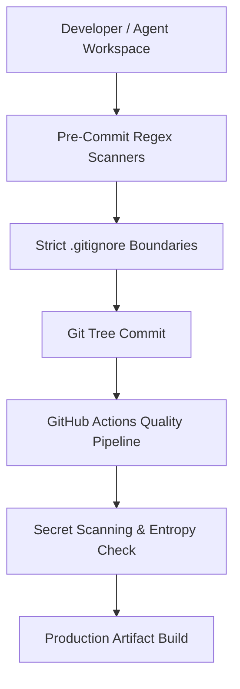

# Secret Exposure Prevention Controls

**Policy Framework:** Zero-Trust Credential Isolation & Automated Leak Prevention  
**Effective Date:** 2026-09-08  
**Applicability:** All contributors, CI/CD pipelines, local development environments, and automated agents.

---

## 1. Multi-Layered Defense Architecture



---

## 2. Implemented Prevention Mechanisms

### A. Strict `.gitignore` Rules
The root and workspace `.gitignore` files forbid tracking of:
- All `.env` and `.env.*` files (except `.env.example`).
- Private runtime configs (`.wrangler`, `.dev.vars`).
- Diagnostic log outputs (`*.log`, `npm-debug.log*`).
- Test execution artifacts and raw dumps (`qa/live-growth-gate/fixtures/raw*`, `private/`).

### B. Safe Environment Variable Inspection
Runtime scripts must never log variable values. Helper functions strictly report existence state:
```javascript
// Example compliant pattern:
const keyState = process.env.POE_ACCESS_KEY ? 'available' : 'missing';
console.log(`POE_ACCESS_KEY: ${keyState}`);
// Non-compliant: console.log(`POE_ACCESS_KEY: ${process.env.POE_ACCESS_KEY}`) -> STRICTLY FORBIDDEN
```

### C. Automated Secret Scanning in CI
`.github/workflows/quality.yml` incorporates a dedicated secret scanner step:
- Scans for high-entropy strings, known prefix signatures (`sk-`, `cfut_`, `rnd_`, `Bearer `), and unauthorized `.env` files.
- Fails the build immediately before any testing or deployment phase.

### D. Zero-PII / Data Minimization in Analytics & QA
- **No Raw Customer Data:** OCR, Regex, and SQL workers are 100% stateless. Temporary memory is deallocated upon stream completion.
- **Synthesized QA Fixtures:** All test suites use strictly synthetic inputs created in-memory or from open public schemas.
- **Zero Request Logging:** Edge workers stream responses directly via SSE and log only categorical metadata (latency bucket, outcome status, error enum).
